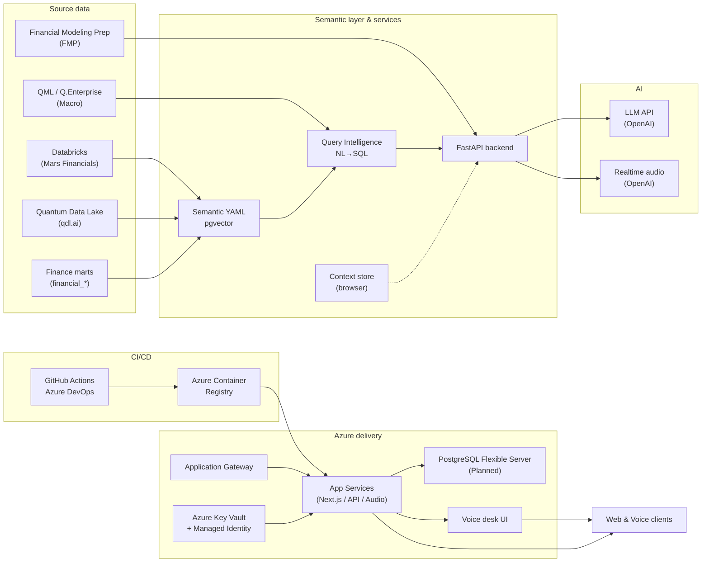

# FinIQ Architecture — Proposed Additions to Rajiv's Diagram

**Context**: For the Mars-facing deck. The current diagram captures the semantic, voice, and Azure delivery layers accurately. Adding three data/security components makes the picture complete so Mars stakeholders see the full data surface FinIQ consumes from.

---

## 1. Additions to the **Source data** column

The current "Source data" group contains Quantum Data Lake (qdl.ai), Financial Model Prep (FMP), and Finance marts. Two additions make the source inventory reflect what's wired into production today:

### 1a. **Databricks** (Mars Corporate Finance Analytics)
- **Role**: Primary data source for Mars's internal financial metrics — P&L by unit, brand, product; NCFO; budget variance; organic growth; MAC Shape; Controllable Earnings.
- **Schema**: `corporate_finance_analytics_prod.finsight_core_model` (production) — `finiq_vw_pl_unit`, `finiq_vw_pl_brand_product`, `finiq_vw_ncfo_unit`, `finiq_dim_unit`, `finiq_dim_rl`, `finiq_financial_replan`, `finiq_date`.
- **How FinIQ reaches it**: SQL Statements REST API via a serverless SQL Warehouse.
- **Position in diagram**: Left column, inside **Source data** group, above Finance marts.

### 1b. **QML — Q.Enterprise** (quantumcloud.ai)
- **Role**: External macroeconomic context provider. 122K+ data series across TRAD_ECON (consumer confidence, CPI by country), FRED (31K+ US economic series), DTNIQ (commodity futures).
- **How FinIQ uses it**: Called by the macro-enrichment service after every Databricks query to append contextual narrative ("US CPI up 2.9% YoY, corn futures down 7.0%…") to financial responses.
- **Position in diagram**: Left column, inside **Source data** group, next to Quantum Data Lake.

---

## 2. Addition to the **Azure delivery** group

### 2a. **Azure Key Vault + Managed Identity**
- **Role**: Secret management + service-principal-free authentication from App Services to Databricks.
- **Why it matters to Mars**: FinIQ never handles raw Databricks tokens in production — the App Service's managed identity authenticates against Databricks via AAD, and any app secrets (FMP keys, OpenAI keys) are pulled from Key Vault at runtime.
- **Position in diagram**: Inside the **Azure delivery** group, between Application Gateway and App Services, with an arrow from App Services reading "reads secrets / obtains tokens".

---

## 3. Suggested labels / clarifications (optional, not additions)

These are minor callouts to reduce Mars reviewer questions. None require new boxes.

- **PostgreSQL Flexible Server**: label as "Planned — job persistence / chat history" so Mars doesn't assume it's live today.
- **Compliance matrix score 1–100**: move outside the runtime bubble and label as "Development quality gate (SRS-driven)" so it's clear this is a build-time tool, not a runtime service.
- **Context store (Zustand)**: label as "Browser client state" and draw it as part of the **Web & Voice clients** layer rather than inside backend services.

---

## 4. Suggested Mars-facing narrative (for the slide beneath the diagram)

> **FinIQ consolidates four data surfaces into a single conversational hub:**
>
> - **Mars internal financials** via Databricks (corporate_finance_analytics_prod) — P&L, organic growth, MAC Shape, NCFO, budget variance, all unit- and brand-level.
> - **Competitor financials** via Financial Modeling Prep — real-time prices, income statements, analyst estimates, ESG scores, earnings transcripts for Nestlé, Mondelez, Hershey, and seven peers.
> - **Macroeconomic context** via QDT's Q.Enterprise (QML) — consumer confidence, CPI, commodity futures, FX, automatically attached to every financial query.
> - **Intent & orchestration** via OpenAI — natural-language query interpretation, SQL generation, and the Realtime voice layer for hands-free interaction.
>
> Delivery is on Azure: App Services hosting Next.js and the voice audio proxy, fronted by Application Gateway, with Azure Key Vault + Managed Identity handling all Databricks authentication without shared secrets. CI/CD flows through GitHub Actions into Azure Container Registry. The platform is containerized and Mars-deployment-ready.

---

## 5. Mermaid quick reference (if Rajiv wants to cross-check)

---

**Summary for Rajiv (short version):**
- Add **Databricks** + **QML** nodes to Source data
- Add **Azure Key Vault + Managed Identity** to Azure delivery
- Optionally mark PostgreSQL as "Planned" and move Compliance matrix out of runtime
- Everything else in your diagram stands as-is
